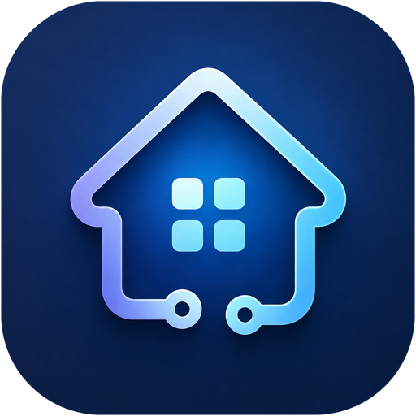

# d3home

A command line for the smart devices in your home. The first of them is a
Polaris PWK 1725CGLD kettle.

```
$ d3home kettle start 80
heating to 80 °C

$ d3home kettle status

  kettle  PWK 1725CGLD  [syncleo]   ● custom

  74 °C  ●●●●●●●●●●●●●●●●●●·······◉  80 °C

  Current temperature  74 °C
  Target temperature   80 °C
  Child lock           no
  Error                no
```

The tool talks to the kettle directly over the local network, in the device's
own UDP protocol. No cloud, no vendor account, no internet: unplug the router's
uplink and it keeps working. **It never changes the device's configuration**, so
the vendor's Polaris IQ Home app keeps working exactly as before — we are simply
another client on the same network, and the kettle never learns otherwise.

## Status

Working and in daily use, but young, and honest about its limits:

- **One device.** The `syncleo` driver covers Polaris IQ Home kettles. It has
  been exercised against a **PWK 1725CGLD, firmware 2.27.0, MCU 1.1.4**. Other
  models in the range speak the same protocol and may well work; nobody has
  tried.
- **Linux.** It uses `termios`, `ioctl(TIOCGWINSZ)` and `if_nametoindex`, so it
  is Unix-shaped; only Linux has been tested.
- **The same network as the device.** There is no remote access, by design.
- The protocol was reverse-engineered. It is pinned by golden vectors and
  verified against real hardware, but it is not a vendor-supported interface and
  a firmware update could change it.

## Installing

Every release publishes a package for each platform, with a `SHA256SUMS` file
beside them.

### Linux

```bash
sudo dpkg -i d3home_0.1.0_amd64.deb          # Debian, Ubuntu
sudo rpm -i d3home-0.1.0-1.x86_64.rpm        # Fedora, openSUSE, RHEL
```

On Arch, build from the AUR recipe in [`packaging/arch/`](packaging/arch/):

```bash
makepkg -si
```

### macOS

```bash
brew install d3home
```

For notifications that carry d3home's own icon, build the application bundle
as well:

```bash
packaging/macos/bundle.sh                    # produces dist/d3home.app
```

macOS shows the icon of whichever application asked for the notification, and
offers no way to choose one. Run from a terminal, every notification carries
Terminal's icon; run from inside a bundle, it carries d3home's. The bundle is
therefore not decoration — it is the only way, and the LaunchAgent in
[`contrib/`](contrib/) should point at the binary inside it.

### Windows

```powershell
winget install Demetri0.d3home
```

Or run the `.msi` from the release page. Either way `d3home` lands on `PATH`,
and the icon travels inside the executable as a resource, which is how
Windows carries one.

### From source

Rust 1.88 or newer.

```bash
git clone https://github.com/Demetri0/d3-home
cd d3-home
make
sudo make install                            # into /usr/local
```

`make install` honours `PREFIX` and `DESTDIR`, so it needs no root:

```bash
make install PREFIX=~/.local
```

It installs the program, its man page, the desktop entry, the icons in every
size an icon theme wants, and shell completions for bash, zsh and fish —
generated by the program itself at install time, so they cannot fall out of
step with the commands that exist.

`cargo install --path crates/d3home` works too, and is the right choice if all
you want is the binary. It installs no icons, no man page and no completions,
because that is not something Cargo does.

## Quick start

```
d3home add                   # finds the kettle, asks for a name and a token
d3home kettle status
d3home kettle start 80
```

The token comes from the vendor app — see [Registering a device](#registering-a-device).
If nothing is found, the usual culprit is a firewall dropping mDNS; see
[When mDNS does not work](#when-mdns-does-not-work).

## Configuration

`~/.config/d3home/devices.toml`, mode `0600`. It holds the device token — the
key to the kettle — so the file belongs neither in a repository nor in a backup
somebody else can read. If it does end up readable by more than its owner
(restored from a backup, copied with `cp` and no `-p`), `d3home` notices and
warns on stderr the next time it loads the config. It still works: the warning
is a nudge, not a refusal.

```toml
[[devices]]
name    = "kettle"
aliases = ["k", "чайник"]
driver  = "syncleo"
vendor  = "polaris"
model   = "PWK 1725CGLD"
mac     = "deadbeefdead"
token   = "..."

# filled in automatically after the first successful discovery
[devices.cached]
address    = "192.168.1.42"
port       = 41122
public_key = "..."
# interface = "enp8s0"   # only needed when address is a link-local IPv6 (fe80::/10)
```

`vendor` and `model` both come from the share link and are optional; a device
registered without them simply has neither. The protocol says nothing about
either: mDNS advertises `_syncleo._udp`, and Syncleo is the platform a brand
builds on rather than the brand itself, so the link is the only place the name
appears at all. `--vendor` sets it by hand, and outranks what the link says.

The kettle may advertise itself over IPv4 or as a link-local IPv6 address of the
`fe80::…` form. You cannot connect to one of those without naming an interface,
so the cache carries the interface name too. The name, not the index: interface
indices are reassigned across a reboot, names are not.

### Registering a device

The config creates itself on the first `add`. You never have to hand-write TOML.

In the Polaris IQ Home app, share the device. You get a link of this shape:

```
https://l.polaris-iot.com/device-share/polaris/57/deadbeefdead?token=deadbeefdeadbeefdeadbeefdeadbeef&name=PWK%201725CGLD
```

From there, three ways in — whichever suits the moment:

```
d3home add "<link>" --name kettle    # from the link: mac and token come out of it
d3home add                           # in a terminal: lists what it found on the
                                     # network, asks for a name and a token
d3home add --name kettle --mac deadbeefdead --token <token>
```

Interactive mode only engages when there is somebody there to answer: in a pipe
or a script it asks nothing and instead says precisely what it is missing. The
token is read **without echoing** — it reaches neither the screen nor your shell
history, unlike the flag form.

Case and separators (`:`, `-`) in `mac` do not matter. `d3home` lowercases it and
strips them when loading the config, so whatever your router's DHCP table shows
(usually uppercase, colon-separated) can be pasted as it is.

### Aliases

The first word after `d3home` is a device name, or any alias you gave it — not a
hardcoded type. So `d3home k start 80` and `d3home чайник start 80` are the same
command; aliases are not restricted to ASCII.

```
d3home alias add k kettle
d3home alias rm k
d3home alias                  # list them
```

An alias that collides with a built-in command (`discover`, `devices`, `alias`,
`help`), with another device's name, or with another device's alias is rejected
when the config loads, with an error naming the collision — rather than resolved
silently and arbitrarily. The same goes for an empty alias, and for one starting
with `-`: no argument parser can read that as a word, so such an alias could
never be typed.

A colon is allowed, which makes grouping by room a matter of naming:
`kitchen:kettle`, `bath:heater`. It works identically everywhere — as the command
word, behind `--device`, and in completion.

## Commands

```
d3home kettle status          # mode, current and target temperature, error flag
d3home kettle start           # boil to 100 (synonym: on)
d3home kettle start 80        # heat to 80
d3home kettle set 80          # set the target without starting
d3home kettle off             # stop (synonym: stop)
d3home kettle watch           # what is happening, until q or Ctrl-C; reconnects itself
d3home kettle trace           # the whole event stream with protocol codes

d3home daemon                 # watch everything and notify; see "The daemon"
d3home add                    # register a device
d3home completions fish       # print a completion script
d3home discover               # what is visible on the network
d3home devices                # what is configured, with model, driver and MAC
```

Global flags: `--device <name>`, `--json`, `--config <path>`, `--help`,
`--version`.

They are accepted **anywhere on the command line** — before the device word,
after the action, after the action's own arguments. `d3home kettle status --json`
behaves exactly like `d3home --json kettle status`. If a device name or alias
begins with a dash, separate it with a double dash: `d3home -- --strange status`.

`start`, `set` and `off` report what they and the kettle actually agreed on — and
not on the strength of a delivery receipt. **An acknowledgement means the frame
arrived, not that the device agreed to act on it.** A kettle with no water in it,
or one lifted off its base, acknowledges perfectly well and then does nothing. So
the state is read back after sending, and the message describes what really
happened. If the kettle did not start, you get exit code 6 and an explanation
rather than a cheerful "heating to 100 °C".

### `set` versus `start`

`start 80` begins heating to 80. `set 80` only records the target: the kettle
stays off, and if it is already heating the target changes underneath it.

### `watch` and a kettle lifted off its base

A kettle spends plenty of its life off its base — lifted, filled, put back. When
it is lifted it loses power **completely**: this is not a dropped connection but a
device switching off, and the whole session goes with it — keys, counters, the
fact that we were ever authorised. Resuming is impossible in principle.

So `watch` does not exit when the connection dies. It runs the full cycle again:
finds the kettle (the address may have changed on a new DHCP lease), performs the
handshake with the same token from the config, opens a new session. Attempts back
off — briefly at first, then twice as long each time, capped at five seconds, so
it does not hammer the network while the kettle sits on a table with tea in it.
The moment it returns is marked in the event stream, because the device replays
its entire state on every connection and an unmarked repeat block would read as a
glitch rather than as a new session.

`watch` waits only on connectivity: a timeout, silence, an unacknowledged
command — everything indistinguishable from "the kettle has no power right now".
A rejected token or a broken config are not cured by waiting, and still return
their exit code immediately, exactly as before.

`watch` expects its output to be piped somewhere (`| jq`, a log, a notifier). If
the reading end closes first (`| head -1`, a notifier that died), `watch` exits
quietly with code 0 rather than crashing.

Single-shot commands (`status`, `start`, `off`) are unchanged: they wait what they
waited before and fail if the kettle is absent. Waiting forever in a command whose
job is to run and exit would be worse, not better.

## How the kettle is found

On first use, an mDNS search for `_syncleo._udp.local`. The address, port and
public key that come back are written to `[devices.cached]`, and later commands go
straight to the known address — no second of searching, and no dependence on
whether mDNS works on that network at all.

When the cached address goes quiet — the router handed out a different IP, or the
kettle rotated its keys — the tool falls back to discovery on its own and updates
the cache. A search for one known device stops as soon as that device answers
rather than running out its window: against the real kettle that is the difference
between 4.4 and 8.8 seconds. It does linger briefly after the answer, because a
device can resolve on several interfaces at once and a global address is worth
more than a link-local one.

The same fallback covers an address that cannot be turned into a socket at all — a
cached link-local IPv6 whose interface has since been renamed, disabled or
replaced (which is exactly why the index is not the thing stored). That is a stale
cache, not an internal error.

A kettle that answers but rejects the handshake is treated differently: no
fallback. A wrong token is not cured by searching again, and hiding that behind a
timeout would be a lie.

### When mDNS does not work

The usual cause on Linux is a firewall dropping inbound UDP 5353:

```
sudo firewall-cmd --add-service=mdns              # until reboot
sudo firewall-cmd --permanent --add-service=mdns  # for good
```

If mDNS is unavailable on the network as a matter of principle,
`[devices.cached]` can be filled in by hand — printing the public key is exactly
what `d3home discover` is for.

### `watch` versus `trace`

The kettle repeats the same values endlessly. `watch` shows not the reports but
the **changes** — the moment something happened:

```
17:22:52  connected — 45 °C, idle
17:23:04  heating to 100 °C
17:26:31  reached 98 °C, switched off
```

The bar sits **above** the log, separated by a blank line. The bar, that blank
line and the last fifteen log lines are one block, redrawn in place: the cursor
moves back to its top, everything below is wiped, and it is printed again. No
terminal setting is touched, so there is nothing to restore afterwards.

```
  71 °C  ●●●●●●●●●●●●●●●●●·······◉  100 °C

17:22:52  connected — 45 °C, idle
17:23:04  heating to 100 °C
```

Diagnostics, hardware versions, access control and the unidentified command codes
stay out of the log: watching a kettle boil and taking a protocol apart are
different jobs.

`trace` is the second job. Everything, with millisecond timestamps and the
protocol code beside the decoded meaning:

```
17:22:31.660  145  diagnostic: udps=61062937 IDLE=49428231 ppT=1201672 tiT=466229
17:22:31.692    1  mode: off
17:22:31.719    2  target temperature: 0 °C
```

On one and the same burst from the device, `watch` prints one line and `trace`
prints thirteen. `trace` is what the two unidentified command codes will
eventually be identified from.

Under `--json` the two are identical — the whole event stream, unfiltered. That is
a stream for a program, not for eyes.

## Completion

Installed already if you used a package or `make install` — those generate the
completions by running the program itself, so they cannot describe commands it
does not have.

After `cargo install`, which installs nothing but the binary, put them in place
yourself:

```
d3home completions fish > ~/.config/fish/completions/d3home.fish
d3home completions bash > ~/.local/share/bash-completion/completions/d3home
d3home completions zsh  > ~/.zsh/completions/_d3home    # directory must be on fpath
```

It completes not only the built-in commands but **your own device names and
aliases** — read from the config at the moment you press Tab, not baked into the
script. So `d3home alias add k kettle` makes `k` completable immediately, with
nothing to regenerate. Actions are suggested per the device's driver, so a new
kind of device brings its own.

If the config is missing or broken, completion still offers the built-ins: a
broken config should not feel like a broken shell.

## Output

On a terminal the output is laid out: `status` prints a block with the values
picked out, and `watch` keeps a live line that appears the moment it starts,
updates after **every** event, and never disappears between readings. During a
heat that line is a progress bar rather than sixty near-identical lines — the
kettle sends one per degree.

The bar's scale is **absolute, 0–100 °C**: one cell is four degrees, and it does
not rescale when the target changes. So 40 °C looks the same whether the kettle is
heading for 60 or for boiling, and the eye never has to recalibrate.

The target is marked with a ring, `◉`. Colour carries the state: heating is green,
idle is white. An idle kettle that still remembers a target is therefore never
mistaken for one in progress.

```
  71 °C  ●●●●●●●●●●●●●●●●●●·······◉  100 °C
```

The same bar appears in `status`, under the heading. That heading names the
device, its model and its driver, so a registry holding several devices stays
legible.

In a pipe the block is not drawn at all: there every line matters and nothing can
be overwritten, so the log runs straight down like any other log.

`watch` exits on **`q`** or Ctrl-C. Reading a single keypress puts the terminal
into character-at-a-time mode for the duration — and restores it on every exit
path, including a signal, where a handler puts the settings back before the
process dies. Ctrl-C keeps behaving exactly as it always did; the tool does not
break the habit.

In a pipe, in a file and under `--json` all of this switches itself off. Escape
sequences in the middle of data are corruption, not decoration. `NO_COLOR` and
`TERM=dumb` are honoured.

```
d3home kettle status        # a block, in colour
d3home kettle status | cat  # plain key: value lines
NO_COLOR=1 d3home kettle status
```

## Listing devices

```
$ d3home devices

  kettle  (k, чайник)
  vendor    polaris
  model     PWK 1725CGLD
  driver    syncleo
  mac       de:ad:be:ef:de:ad
  endpoint  192.168.1.42:41122
```

The identifier shown is the **MAC, not a slice of the token**. The MAC is already
broadcast over mDNS, so it is in no sense secret, and it is what the router's
admin page and the vendor's share link both display — which is what ties a line in
this list to an object on a worktop. Printing part of a secret is a habit worth
not forming.

## The daemon

`d3home daemon` watches the configured devices and tells you when something
happens — most usefully that the kettle has boiled, so you can walk away from
it. It runs in the foreground and does not fork, so whatever starts it decides
when it stops: systemd, launchd, Task Scheduler, or a terminal you leave open.

```
$ d3home daemon
d3home: watching kettle via notify-send
```

It says which notifier it chose at startup, because the alternative is
wondering later why nothing appeared.

A notification is headed with the model and the name you gave the device, and
says what happened:

```
PWK 1725CGLD · kettle
Heating complete
```

The vendor's app heads its own notifications with the model alone, which stops
being useful the moment there are two of something. Devices with no `model` in
the config are headed with their name by itself. The temperature is not
repeated in the text — it reaches a custom command through
`D3HOME_TEMPERATURE`, where a program can do something with it, rather than
crowding a line meant for a person.

### Settings

Every part is optional. A config with no `[daemon]` section watches every
device and reports the two events worth interrupting somebody for.

```toml
[daemon]
devices = ["kettle"]      # omit to watch everything configured

[daemon.notify]
on = ["boiled", "error"]  # the default
# icon = "weather-clear"  # for every device that names none of its own
# command = "ntfy publish my-topic \"$D3HOME_BODY\""
```

A device can carry its own icon, which is the useful place for it once there
is more than one kind of thing being watched:

```toml
[[devices]]
name = "kettle"
icon = "/home/you/.local/share/icons/kettle.png"
```

Either a name from the icon theme or a path. A name is the better answer: it
survives the file being moved and it follows whatever theme you have chosen.
Unset, a device uses the daemon's icon; unset there too, it uses `d3home`,
which is the name the packages install. A name nothing matches costs nothing —
the notification simply arrives without a picture.

| Event | When |
| --- | --- |
| `boiled` | heating ended within two degrees of the target |
| `stopped` | heating ended short of it — somebody switched it off |
| `started` | heating began, including from the vendor's app |
| `error` | the device began reporting an error |
| `offline` | the connection was lost — the kettle lifted off its base |
| `online` | it came back |

`offline` and `online` are off by default: a kettle leaves its base many times
a day, and notifications for it would be noise.

A misspelt event name is refused when the config loads, with the list of real
ones. Accepting it would mean waiting all evening for a notification that was
never going to come.

### How a notification is delivered

No notification library is linked. d3home looks for a command that already
exists on the system and uses the first one it finds:

| Order | Command | Where it comes from |
| --- | --- | --- |
| 1 | `notify-send` | freedesktop — GNOME, KDE, dunst, mako, swaync all answer it |
| 2 | `kdialog` | KDE |
| 3 | `zenity` | GTK |
| 4 | `osascript` | macOS, always present |
| 5 | `powershell.exe` | Windows, always present |

The choice is made by **whether the binary exists**, never by sending a test
notification and seeing what happens — nobody should have to dismiss five
popups because a program was working out how to talk to them. If none is
found, d3home says so at startup and carries on watching; a missing popup is
not a reason to stop.

`command` overrides all of it, for a phone, a chat room, or a light bulb. The
event reaches it through the environment rather than through the command
string, so a device name or a body containing a quote cannot change what runs:

| Variable | Example |
| --- | --- |
| `D3HOME_EVENT` | `boiled` |
| `D3HOME_DEVICE` | `kettle` |
| `D3HOME_TITLE` | `PWK 1725CGLD · kettle` |
| `D3HOME_BODY` | `Heating complete` |
| `D3HOME_TEMPERATURE` | `98` |
| `D3HOME_TARGET` | `100` |

A reading the device did not send is absent rather than empty.

### Keeping it running

Three examples in [`contrib/`](contrib/), all of which run d3home **in the
logged-in user's session**, because that is the only place a notification can
appear.

```bash
# Linux, systemd user unit
mkdir -p ~/.config/systemd/user
cp contrib/d3home.service ~/.config/systemd/user/
systemctl --user enable --now d3home
journalctl --user -u d3home -f

# macOS, LaunchAgent
cp contrib/com.d3home.daemon.plist ~/Library/LaunchAgents/
launchctl load ~/Library/LaunchAgents/com.d3home.daemon.plist

# Windows, scheduled task
schtasks /Create /XML contrib\d3home-task.xml /TN d3home
```

Windows gets a scheduled task rather than a service, and this is not a
compromise: since Vista, services run in session 0 and are barred from the
user's desktop, so a service could not show a notification at all.

The daemon writes diagnostics to stderr and nothing else — no log file, no
rotation, no configuration for either. Whatever starts it already collects
stderr and already knows how to rotate it, and `journalctl --user -u d3home`
does a better job than a second implementation would.

## Exit codes

| Code | What happened |
|------|---------------|
| 0 | success |
| 1 | internal error |
| 2 | bad arguments or bad config |
| 3 | device not found on the network |
| 4 | handshake rejected — wrong token |
| 5 | timeout, device not answering |
| 6 | device refused, or reported an error of its own |

Under `--json`, **failures are machine-readable too**. The shape changes, the
stream does not: failures go to stderr so that stdout carries only the answer and
a redirect to a file is never polluted.

```
$ d3home --json teapot status
{"error":{"exit_code":2,"kind":"usage","message":"no device matches 'teapot'"}}
```

`kind` is what a script may rely on: the wording of a message can be improved at
any time, the slug and the exit code cannot. The values are `usage`, `not_found`,
`bad_token`, `timeout`, `device`, `internal`.

The promise covers the whole stream: under `--json` **every** line on stderr is
JSON, warnings included. A promise kept only for errors is worse than none at
all — a parser would trip on precisely the warning that was overlooked.

A command counts as successful only once the kettle has confirmed it. When there
was no confirmation the exit code says so; success is never printed for a command
the device did not take.

## How it is put together

Two crates:

- **`syncleo`** — the protocol. Inside it, the pure part (`codec`, `session`: no
  sockets, no system clocks, time arrives as an argument) is kept strictly apart
  from the part that does I/O (`transport`, `client`, `discovery`). That is why
  the session state machine is tested on a virtual clock — deterministically and
  instantly.
- **`d3home`** — the CLI: the device registry, argument parsing, output, exit
  codes.

The protocol was rewritten from scratch against the Python implementation at
[gch1p/polaris_pwk_1725cgld](https://github.com/gch1p/polaris_pwk_1725cgld)
(BSD-3c), which is known to drive the real device. The cryptography is pinned by
golden vectors captured from that implementation: key derivation, frame
encryption, the handshake, acknowledgements and pings are all compared byte for
byte.

The crate carries a kettle simulator (feature `simulator`, off by default, never
compiled into the shipped binary). It implements the device side of the protocol,
which buys end-to-end tests over real UDP and makes development possible when the
kettle is not at hand.

```
cargo test --workspace
```

One test is marked `#[ignore]` — it needs a real network with working multicast.

## Packaging

| Platform | Format | Built by |
| --- | --- | --- |
| Debian, Ubuntu | `.deb` | `cargo deb` from the metadata in `crates/d3home/Cargo.toml` |
| Fedora, openSUSE | `.rpm` | [`packaging/rpm/d3home.spec`](packaging/rpm/d3home.spec), which calls `make install` |
| Arch | `PKGBUILD` | [`packaging/arch/`](packaging/arch/), which calls `make install` |
| macOS | Homebrew formula, `.app` | [`packaging/homebrew/`](packaging/homebrew/), [`packaging/macos/bundle.sh`](packaging/macos/bundle.sh) |
| Windows | `.msi`, winget manifest | [`packaging/windows/`](packaging/windows/), [`packaging/winget/`](packaging/winget/) |

The `Makefile` is the single description of what gets installed where; the
rpm and the PKGBUILD both call it rather than each listing the same files in
a slightly different way. Debian's tooling cannot call a Makefile, so the
`.deb` lists its assets in `Cargo.toml` — that list and the `Makefile` are
the one place where the same thing is said twice.

Everything is built by [`.github/workflows/release.yml`](.github/workflows/release.yml)
when a `v*` tag is pushed, each package on the platform whose tools it needs:
a `.deb` wants dpkg, an `.msi` wants WiX on Windows, and an `.app` wants
`iconutil` on a Mac. The same test suite runs on each of those machines
before anything is uploaded.

## The protocol

[`docs/protocol.md`](docs/protocol.md) documents the wire protocol as the device
actually speaks it: discovery, the key exchange and its three byte reversals,
framing, encryption, the command table, and the places where a real kettle
disagrees with the reference implementation.

## Not done yet

- Event history and statistics. The daemon recognises the moments; nothing
  writes them down yet.
- Roborock vacuums and Alice BT remotes. The driver and the CLI are separated for
  exactly this.
- Working from outside the home network.

## Contributing

Issues and patches are welcome, particularly:

- **Another Polaris model.** If `d3home discover` sees your device and `status`
  reads it, say so — that is the cheapest way to widen the tested range. If it
  does not, `d3home <device> trace` is the output worth attaching.
- **The two unidentified command codes**, 50 and 66. See
  [`docs/protocol.md`](docs/protocol.md) for what has been ruled out already.

`cargo test --workspace` and `cargo clippy --all-targets --workspace -- -D warnings`
should both be clean, and `cargo fmt --all` should leave the tree unchanged —
CI runs exactly those, plus a build against the declared minimum Rust. New behaviour comes with a test; the simulator in
`crates/syncleo/src/simulator.rs` means you do not need a kettle to write one.

## Credit

The protocol was worked out from
[gch1p/polaris_pwk_1725cgld](https://github.com/gch1p/polaris_pwk_1725cgld) by
Evgeny Zinoviev (BSD-3-Clause) — a Python implementation known to drive the real
device. This is an independent implementation in Rust, but without that work it
would have been a great deal of packet-staring.

## License

MIT ([LICENSE-MIT](LICENSE-MIT)) or Apache-2.0 ([LICENSE-APACHE](LICENSE-APACHE)),
at your option.

Unless you state otherwise, any contribution you submit for inclusion shall be
dual-licensed as above, with no additional terms.
